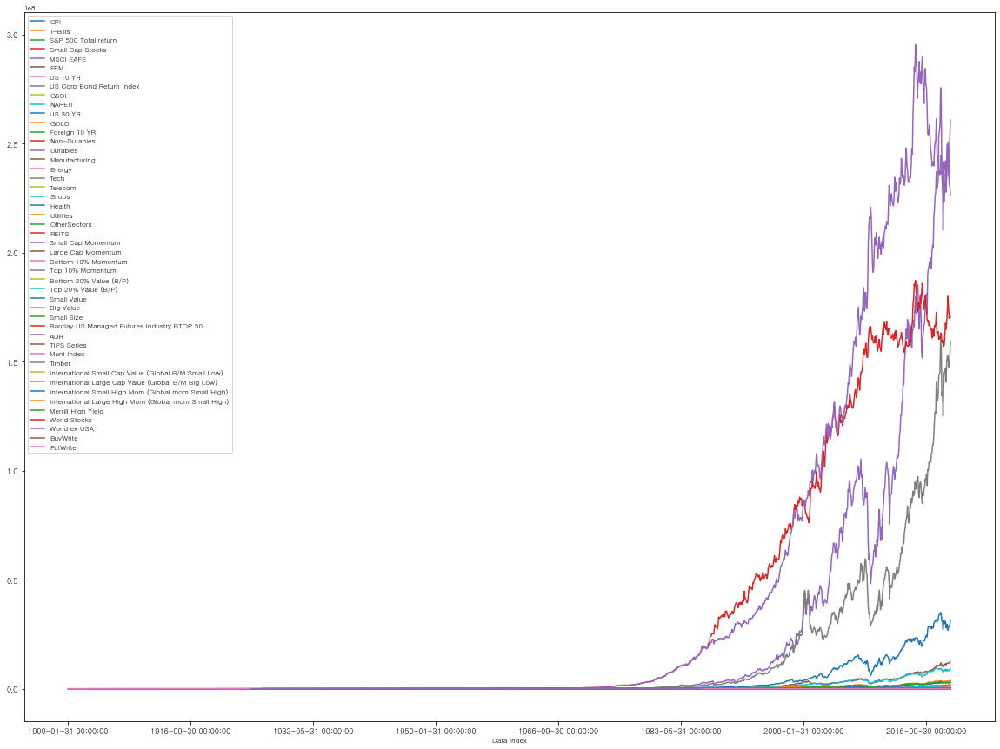
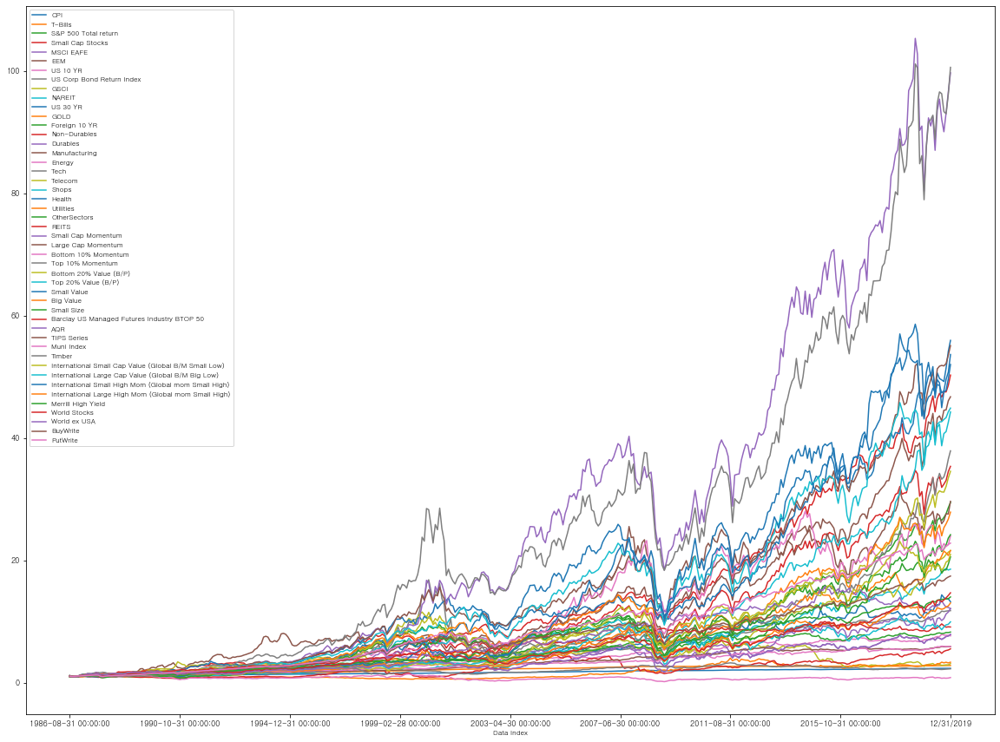
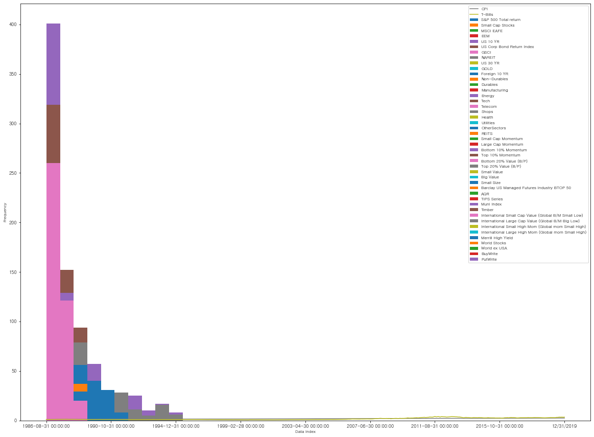
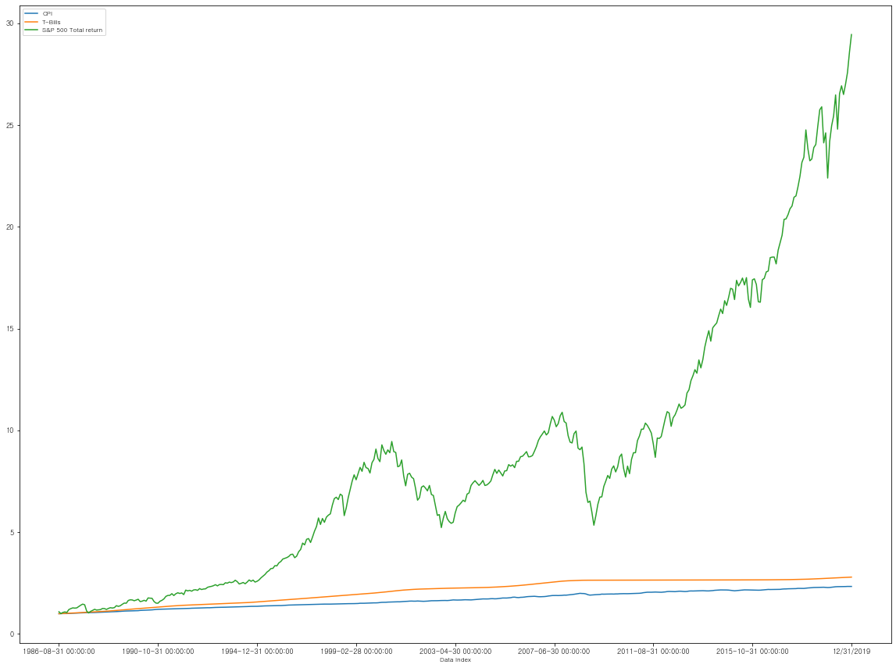
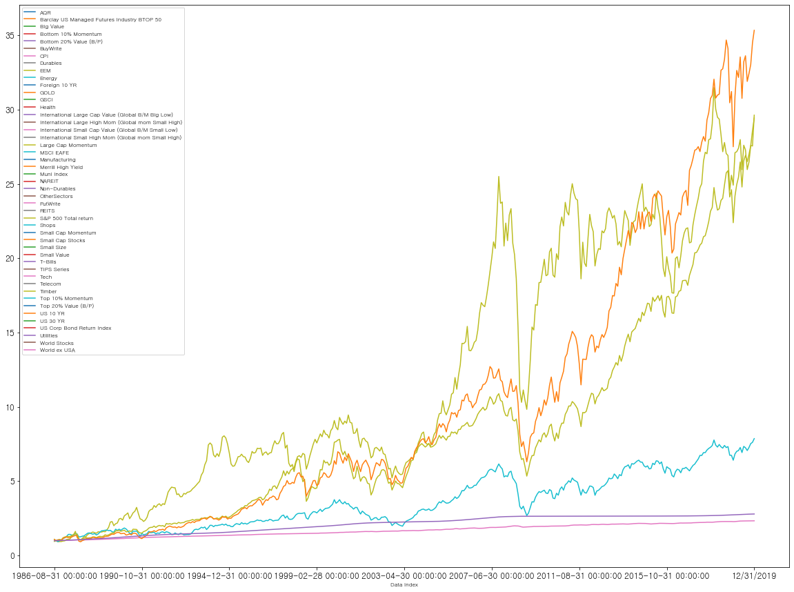
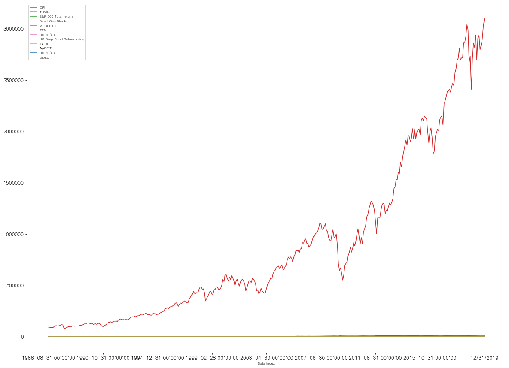

```python

import pandas as pd
#판다스 불러오기
import matplotlib.pyplot as plt
#graph tool 불러오기
import numpy as np
#연산 tool 불러오기


import matplotlib
#graph lib
matplotlib.font_manager._rebuild()
#graph font rebuild - 안될때 추가

matplotlib.rc('font', family= 'Gulim' ,size=8, weight = 'bold')

파일 = pd.ExcelFile('C:\Python\Backtester2.xlsx')
자산군 = 파일.sheet_names
자산군


자료 = {}
for i in 자산군:
    자료[i] = 파일.parse(i)
        #파일 자료이름 넣기 
    print(i+'개수',len(자료[i].columns))
    #sheet names개수, length 자료의 columns print하기
    자료[i].drop( index=(0), axis = 1, inplace=True)
    자료[i].drop( index=(1), axis = 1, inplace=True)
    자료[i].drop( index=(2), axis = 1, inplace=True)
    

    # idx = pd.Index(['a', 'b', 'c'])
    # idx.delete(1)
    # Index(['a', 'c'], dtype='object')
    # idx = pd.Index(['a', 'b', 'c'])
    # idx.delete([0, 2])
    # Index(['b'], dtype='object')\
    
print(자료.keys())
print(자료['AssetPrices'])
# b = 자료['국가'].KOSPI/자료['국가'].KOSPI.iloc[0]
print(i+'개수',len(자료[i].columns))


    # 자료[i].index = 자료[i].data_index
    #  해당 자료군 안에 날짜를 기준 index로 설정해주기
    # 자료[i].drop(index = (0))
    #Day 한 column 지워주기, 위치 당겨주기)


b = 자료['AssetPrices'].GOLD
c = 자료['AssetPrices'].CPI
# /자료['AssetPrices'].CPI.iloc[0]
# 1기준점 지정(초기치로 나누기)
d = pd.concat([b, c], axis=1).dropna()

# b.index = 자료[i](index=(0))
# b.columns = ['GOLD','CPI']
# The column labels of the DataFrame.

# c.divide(c.iloc[0]).plot(fontsize = (10), figsize = (15,10))
# d.plot(fontsize = (10), figsize = (15,10))
# Divide by constant with reverse version. - divide
# Purely integer-location based indexing for selection by position. - iloc
# plt.show() 
# Provide useful information, important for bug reports.


print(type(자료[i].columns))
print((자료[i].columns))


print(자료[i].iloc[0])
#첫행 print


# print(자료[i].loc[0])

# Access a group of rows and columns by label(s) or a boolean array.
# .loc[] is primarily label based
# , but may also be used with a
# boolean array.
# Similar to iloc, in that both 
# provide integer-based lookups.
#  Use iat if you only need to 
#  get or set a single value in 
#  a DataFrame or Series.


# Access a group of rows and colu6
# mns by label(s) or a boolean arra
# y.

# .loc[] is primarily label based,
#  but may also be used with a
#  boolean array.

# df.loc[:, 'max_speed'] = 30

print(자료[i].loc[:, 'Data Index':'CPI'])
#열 print

자료[i].index = 자료[i].loc[:,'Data Index']
자료[i].pop('Data Index')
자료[i].pop('Broker Call Rate')
print(자료[i].loc[:,'CPI'])
#INDEX를 Data INDEX(날짜)로 바꾸기 / 열지우기 - pop


자료[i].plot(fontsize = (9), figsize = (20,15))

# 자료[i].divide(자료[i].iloc[1]).plot(fontsize= (10), figsize = (15,10))
# 1986-09-30 00:00:00 이후 자료만 있음


자료[i] = 자료[i].dropna()
# 1986-09-30 00:00:00 이후 자료만 남기기 drop NA

자료[i].divide(자료[i].iloc[1]).plot(fontsize= (9), figsize = (20,15))
# 자료[i] = 자료[i].divide(자료[i].iloc[1])

# b = 자료['국가'].KOSPI/자료['국가'].KOSPI.iloc[0

자료[i].divide(자료[i].iloc[1]).plot.hist()

#histogram"
    
    
#자료[i].divide(자료[i].iloc[1]).plot(fontsize= (9), figsize = (20,15))\n",
GraphA = 자료[i].CPI
GraphB = 자료[i].GOLD

GraphA.divide(GraphA.iloc[1]).plot(fontsize= (9), figsize = (20,15))
GraphB.divide(GraphB.iloc[1]).plot(fontsize= (9), figsize = (20,15))
   
Graphk = 자료[i].iloc[:,0:3] 

Graphk.divide(Graphk.iloc[1]).plot(fontsize= (9), figsize = (20,15))

#for in 사용??


#ExcelFile.parse(sheet_name=0, header=0, names=None, index_col=None, usecols=None, squeeze=False, converters=None, true_values=None, false_values=None, skiprows=None, nrows=None, na_values=None, parse_dates=False, date_parser=None, thousands=None, comment=None, skipfooter=0, convert_float=True, mangle_dupe_cols=True, **kwds)[source]\n",
#Parse specified sheet(s) into a DataFrame.

#Equivalent to read_excel(ExcelFile, …) See the read_excel docstring for more info on accepted parameters.

자료[i].iloc[:,0:6].divide(자료[i].iloc[1]).plot(fontsize= (12), figsize = (20,15))
#0~6행 출력
자료[i].loc[:,'CPI':'GOLD'].plot(fontsize= (12), figsize = (20,15))
#CPI~GOLD 출력"

#Asset divers

#def monthlyreturn
#print(자료['AssetPrices'])

CPI = 자료[i].CPI
GOLD = 자료[i].GOLD
US30 = 자료[i].loc[:,'US 30 YR']
US10 = 자료[i].loc[:,'US 10 YR']
#print(자료[i].loc[:,'US 30 YR'])

CPI = CPI.divide(CPI.iloc[0])
GOLD = GOLD.divide(GOLD.iloc[0])
US30 = US30.divide(US30.iloc[0])
US10 = US10.divide(US10.iloc[0])
#print(CPI)
#print(GOLD)

CPI.plot(fontsize= (12), figsize = (20,15))
#소비자물가지수
GOLD.plot(fontsize= (12), figsize = (20,15))
#GOLD
US30.plot(fontsize= (12), figsize = (20,15))
#US 30year bond
US10.plot(fontsize= (12), figsize = (20,15))
#US 10year bond

#Asset divers
#def monthlyreturn
#print(자료['AssetPrices'])
SNP500 = 자료[i].loc[:,'S&P 500 Total return']
WORLD = 자료[i].loc[:,'World Stocks']
VALUE = 자료[i].loc[:,'Top 20% Value (B/P)']
print(자료[i].loc[:,'US 30 YR'])

SNP500 = SNP500.divide(SNP500.iloc[0])
WORLD = WORLD.divide(WORLD.iloc[0])
VALUE = VALUE.divide(VALUE.iloc[0])

#print(CPI)
#print(GOLD)

SNP500.plot(fontsize= (12), figsize = (20,15))
WORLD.plot(fontsize= (12), figsize = (20,15))
VALUE.plot(fontsize= (12), figsize = (20,15))
```

    AssetPrices개수 49
    dict_keys(['AssetPrices'])
                   Data Index Broker Call Rate      CPI  T-Bills  \
    3     1900-01-31 00:00:00              NaN    7.448   42.559   
    4     1900-02-28 00:00:00              NaN    7.448  42.6654   
    5     1900-03-31 00:00:00              NaN    7.448   42.772   
    6     1900-04-30 00:00:00              NaN    7.448   42.879   
    7     1900-05-31 00:00:00              NaN    7.448  42.9862   
    ...                   ...              ...      ...      ...   
    1438           08/31/2019              NaN  256.558   2345.4   
    1439           09/30/2019              NaN  256.759  2349.08   
    1440           10/31/2019              NaN  257.346  2352.05   
    1441           11/30/2019              NaN  257.208  2355.17   
    1442           12/31/2019              NaN  257.259  2358.21   
    
         S&P 500 Total return Small Cap Stocks MSCI EAFE      EEM US 10 YR  \
    3                0.101342              NaN       NaN      NaN      NaN   
    4                0.103484              NaN       NaN      NaN      NaN   
    5                0.104631              NaN       NaN      NaN      NaN   
    6                0.106294              NaN       NaN      NaN      NaN   
    7                0.101591              NaN       NaN      NaN      NaN   
    ...                   ...              ...       ...      ...      ...   
    1438              5898.23      2.79626e+06   7762.67  3073.92  11553.9   
    1439              6008.59       2.8424e+06   7988.98  3133.61  11386.4   
    1440              6138.73      2.89584e+06   8276.83  3266.09  11352.3   
    1441              6361.56      3.02354e+06   8371.39  3261.81  11318.8   
    1442              6553.57      3.09762e+06   8644.84   3507.3    11197   
    
         US Corp Bond Return Index  ...   Timber  \
    3                          NaN  ...      NaN   
    4                          NaN  ...      NaN   
    5                          NaN  ...      NaN   
    6                          NaN  ...      NaN   
    7                          NaN  ...      NaN   
    ...                        ...  ...      ...   
    1438                   429.431  ...   107.92   
    1439                   426.767  ...  108.905   
    1440                   429.508  ...  110.596   
    1441                   431.213  ...  112.048   
    1442                   432.135  ...  113.399   
    
         International Small Cap Value (Global B/M Small Low)  \
    3                                                   NaN     
    4                                                   NaN     
    5                                                   NaN     
    6                                                   NaN     
    7                                                   NaN     
    ...                                                 ...     
    1438                                            20376.2     
    1439                                            20944.7     
    1440                                            21878.8     
    1441                                            22152.3     
    1442                                              23291     
    
         International Large Cap Value (Global B/M Big Low)  \
    3                                                   NaN   
    4                                                   NaN   
    5                                                   NaN   
    6                                                   NaN   
    7                                                   NaN   
    ...                                                 ...   
    1438                                             9600.2   
    1439                                            10106.1   
    1440                                            10487.1   
    1441                                            10588.9   
    1442                                            11029.3   
    
         International Small High Mom (Global mom Small High)  \
    3                                                   NaN     
    4                                                   NaN     
    5                                                   NaN     
    6                                                   NaN     
    7                                                   NaN     
    ...                                                 ...     
    1438                                            52599.2     
    1439                                            53025.2     
    1440                                              55072     
    1441                                            56377.2     
    1442                                            59585.1     
    
         International Large High Mom (Global mom Small High) Merrill High Yield  \
    3                                                   NaN                  NaN   
    4                                                   NaN                  NaN   
    5                                                   NaN                  NaN   
    6                                                   NaN                  NaN   
    7                                                   NaN                  NaN   
    ...                                                 ...                  ...   
    1438                                              13314              1371.18   
    1439                                            13436.4              1375.53   
    1440                                            13745.5              1378.72   
    1441                                            13924.2              1382.49   
    1442                                            14457.5              1411.39   
    
         World Stocks World ex USA BuyWrite PutWrite  
    3             NaN          NaN      NaN      NaN  
    4             NaN          NaN      NaN      NaN  
    5             NaN          NaN      NaN      NaN  
    6             NaN          NaN      NaN      NaN  
    7             NaN          NaN      NaN      NaN  
    ...           ...          ...      ...      ...  
    1438       263614       116013  1441.79  1873.58  
    1439       269350       119395  1451.16  1890.45  
    1440       276279       123697  1481.11  1934.55  
    1441       284105       125110  1500.23  1956.28  
    1442       292725       129197     1514  1974.62  
    
    [1440 rows x 49 columns]
    AssetPrices개수 49
    <class 'pandas.core.indexes.base.Index'>
    Index(['Data Index', 'Broker Call Rate', 'CPI', 'T-Bills',
           'S&P 500 Total return', 'Small Cap Stocks', 'MSCI EAFE', 'EEM',
           'US 10 YR', 'US Corp Bond Return Index', 'GSCI', 'NAREIT', 'US 30 YR',
           'GOLD', 'Foreign 10 YR', 'Non-Durables', 'Durables', 'Manufacturing',
           'Energy', 'Tech', 'Telecom', 'Shops', 'Health', 'Utilities',
           'OtherSectors', 'REITS', 'Small Cap Momentum', 'Large Cap Momentum',
           'Bottom 10% Momentum', 'Top 10% Momentum', 'Bottom 20% Value (B/P)',
           'Top 20% Value (B/P)', 'Small Value', 'Big Value', 'Small Size',
           'Barclay US Managed Futures Industry BTOP 50', 'AQR', 'TIPS Series',
           'Muni Index', 'Timber',
           'International Small Cap Value (Global B/M Small Low)',
           'International Large Cap Value (Global B/M Big Low)',
           'International Small High Mom (Global mom Small High)',
           'International Large High Mom (Global mom Small High)',
           'Merrill High Yield', 'World Stocks', 'World ex USA', 'BuyWrite',
           'PutWrite'],
          dtype='object')
    Data Index                                              1900-01-31 00:00:00
    Broker Call Rate                                                        NaN
    CPI                                                                   7.448
    T-Bills                                                              42.559
    S&P 500 Total return                                               0.101342
    Small Cap Stocks                                                        NaN
    MSCI EAFE                                                               NaN
    EEM                                                                     NaN
    US 10 YR                                                                NaN
    US Corp Bond Return Index                                               NaN
    GSCI                                                                    NaN
    NAREIT                                                                  NaN
    US 30 YR                                                                NaN
    GOLD                                                                    NaN
    Foreign 10 YR                                                           NaN
    Non-Durables                                                            NaN
    Durables                                                                NaN
    Manufacturing                                                           NaN
    Energy                                                                  NaN
    Tech                                                                    NaN
    Telecom                                                                 NaN
    Shops                                                                   NaN
    Health                                                                  NaN
    Utilities                                                               NaN
    OtherSectors                                                            NaN
    REITS                                                                   NaN
    Small Cap Momentum                                                      NaN
    Large Cap Momentum                                                      NaN
    Bottom 10% Momentum                                                     NaN
    Top 10% Momentum                                                        NaN
    Bottom 20% Value (B/P)                                                  NaN
    Top 20% Value (B/P)                                                     NaN
    Small Value                                                             NaN
    Big Value                                                               NaN
    Small Size                                                              NaN
    Barclay US Managed Futures Industry BTOP 50                             NaN
    AQR                                                                     NaN
    TIPS Series                                                             NaN
    Muni Index                                                          41.1601
    Timber                                                                  NaN
    International Small Cap Value (Global B/M Small Low)                    NaN
    International Large Cap Value (Global B/M Big Low)                      NaN
    International Small High Mom (Global mom Small High)                    NaN
    International Large High Mom (Global mom Small High)                    NaN
    Merrill High Yield                                                      NaN
    World Stocks                                                            NaN
    World ex USA                                                            NaN
    BuyWrite                                                                NaN
    PutWrite                                                                NaN
    Name: 3, dtype: object
                   Data Index Broker Call Rate      CPI
    3     1900-01-31 00:00:00              NaN    7.448
    4     1900-02-28 00:00:00              NaN    7.448
    5     1900-03-31 00:00:00              NaN    7.448
    6     1900-04-30 00:00:00              NaN    7.448
    7     1900-05-31 00:00:00              NaN    7.448
    ...                   ...              ...      ...
    1438           08/31/2019              NaN  256.558
    1439           09/30/2019              NaN  256.759
    1440           10/31/2019              NaN  257.346
    1441           11/30/2019              NaN  257.208
    1442           12/31/2019              NaN  257.259
    
    [1440 rows x 3 columns]
    Data Index
    1900-01-31 00:00:00      7.448
    1900-02-28 00:00:00      7.448
    1900-03-31 00:00:00      7.448
    1900-04-30 00:00:00      7.448
    1900-05-31 00:00:00      7.448
                            ...   
    08/31/2019             256.558
    09/30/2019             256.759
    10/31/2019             257.346
    11/30/2019             257.208
    12/31/2019             257.259
    Name: CPI, Length: 1440, dtype: object
    Data Index
    1986-08-31 00:00:00    1208.93
    1986-09-30 00:00:00    1162.62
    1986-10-31 00:00:00    1168.65
    1986-11-30 00:00:00    1203.33
    1986-12-31 00:00:00    1199.66
                            ...   
    08/31/2019             16674.9
    09/30/2019             16157.4
    10/31/2019             15888.9
    11/30/2019             15918.2
    12/31/2019             15371.8
    Name: US 30 YR, Length: 401, dtype: object
    


    <matplotlib.axes._subplots.AxesSubplot at 0x2709aced408>




















```python

```
